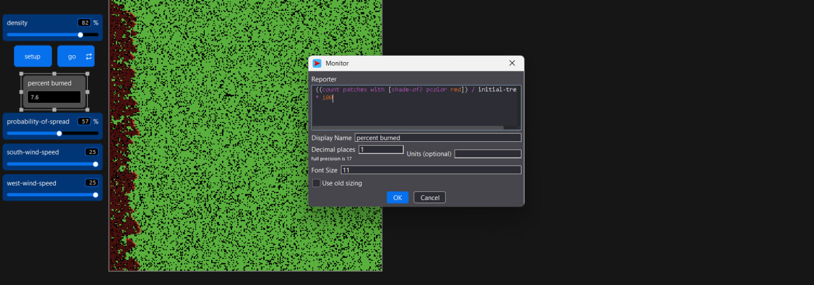
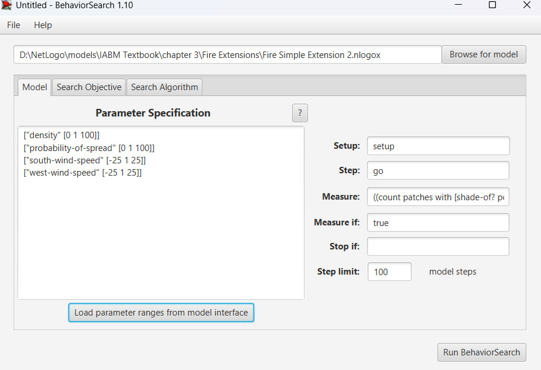
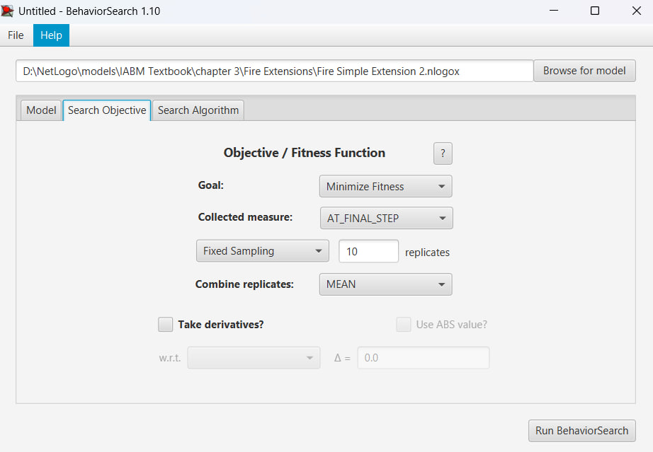
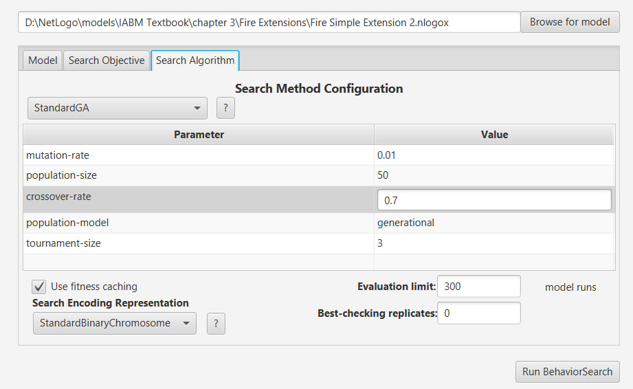
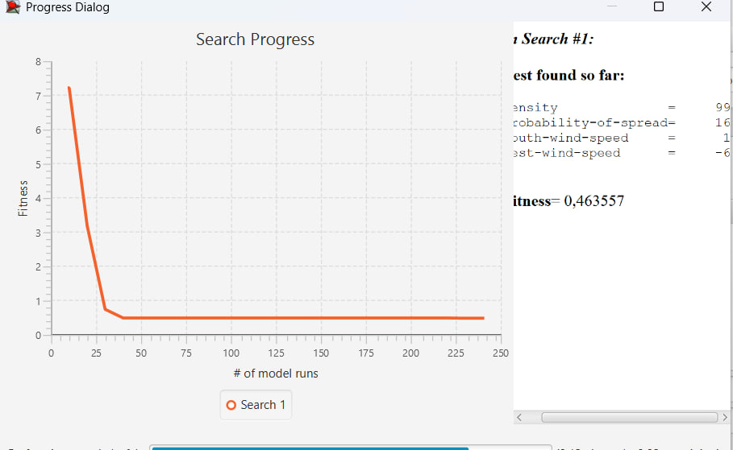
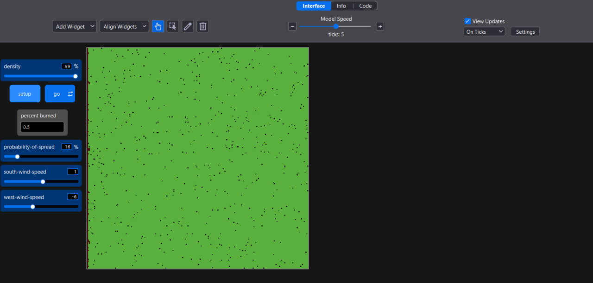

## Комп'ютерні системи імітаційного моделювання
## СПм-24-2, Винниченко Сергій Андрійович
### Лабораторна робота №**3**. Використання засобів обчислювального интелекту для оптимізації імітаційних моделей

 

### Варіант 5, модель у середовищі NetLogo:
[Fire Simple Extension 2](http://www.netlogoweb.org/launch#http://www.netlogoweb.org/assets/modelslib/IABM%20Textbook/chapter%203/Fire%20Extensions/Fire%20Simple%20Extension%202.nlogox)

 

### Вербальний опис моделі:

Модель симулює поширення вогню через ліс і демонструє, як сила вітру впливає на поширення пожежі. Ліс представлений як сітка клітинок (певних ділянок, кожна з яких може бути деревом), де кожне дерево має шанс загорітися, якщо його сусіднє дерево вже горить. Ця модель є модифікацією попередньої Fire Simple Extension 1, додаючи елемент вітру, що змінює ймовірність загоряння дерев в залежності від напрямку та сили вітру.

### Керуючі параметри:

- **density** регулює щільність дерев у лісі, що впливає на кількість зелених клітин на початку симуляції; чим більша щільність, тим більше дерев у лісі.
- **probability-of-spread** визначає ймовірність того, що вогонь перекинеться з одного дерева на інше. Його можна змінювати, щоб контролювати, наскільки швидко або повільно поширюється пожежа.
- **south-wind-speed** впливає на те, як вітер з півдня або з півночі змінює ймовірність поширення вогню. Якщо значення позитивне, це означає, що вітер дме з півдня, якщо ж значення від’ємне, це означає, що вітер дме з півночі.
- **west-wind-speed** регулює вітер з заходу або зі сходу, і його вплив на поширення вогню. Позитивне значення означає, що вітер дме із заходу, якщо ж значення негативне, це вказує на вітер зі сходу.

### Внутрішні параметри:

- **initial-trees** показує скільки дерев було на початку симуляції. Іншими словами, з якою кількістю буде починатись симуляція.
- **probability** визначає ймовірність розповсюдження вогню, враховуючи силу вітру.
- **direction** напрямок від поточного зеленого дерева до палаючого дерева.

### Показники роботи системи:

- відсоток згорілих дерев, що дозволяє оцінити масштаб руйнування лісу.
- швидкість поширення вогню, яка залежить від налаштувань ймовірності поширення та впливу вітру.

 

### Налаштування середовища BehaviorSearch:

**Обрана модель**:
<pre>
E:\Programs\NetLogo\models\IABM Textbook\chapter 3\Fire Extensions\Fire Simple Extension 2.nlogox
</pre>
**Параметри моделі** (вкладка Model):  
Натиснувши на кнопку "Load parameter ranges from model interface" можна у вкладці Model отримати усі параметри поточної моделі. Для лабораторної роботи було змінено початкові значення параметрів density та probability-of-spread на 40. Значення вітру також було змінено на 5. Значення вітру було змінено через те, що при використанні негативного значення west-wind-speed значення ураження було мінімальним завжди. Це пов'язано з недоліком моделі.
<pre>
["density" [40 1 100]]
["probability-of-spread" [40 1 100]]
["south-wind-speed" [5 1 25]]
["west-wind-speed" [5 1 25]]
</pre>
Використовувана **міра**:  
Для фітнес-функції було обрано **значення ураження лісу від пожежі**, вираз для її розрахунку взято з налаштувань монітору аналізованої імітаційної моделі в середовищі NetLogo  

 

та вказано у параметрі "**Measure**":
<pre>
((count patches with [shade-of? pcolor red]) / initial-trees) * 100
</pre>

Відсоток ураження лісу від пожежі повинно вираховуватися завдяки кількості червоних патчів ділених на початкову кількість дерев, та результат цього розрахунку помноженого на 100, для того щоб отримати значення у відсотках. Період симуляції рівний 100 тактів, починаючи з 0 такту симуляції.
Параметр зупинки за умовою ("**Stop if**") у разі не використовувався.  
Загальний вигляд вкладки налаштувань параметрів моделі:

**Налаштування цільової функції** (вкладка Search Objective):  
Метою підбору параметрів імітаційної моделі, що описує рух вогню по лісу, є мінімізація значення ураження лісу від пожежі – це вказано через параметр "**Goal**" зі значенням **Minimize Fitness**. Тобто необхідно визначити такі параметри налаштувань моделі, у яких ліс згоряє з мінімальним значенням ураження. При цьому цікавить значення на останньому кроці симуляції. Для цього у параметрі "**Collected measure**", що визначає спосіб обліку значень обраного показника, вказано **AT_FINAL_STEP**.  
Щоб уникнути викривлення результатів через випадкові значення, що використовуються в логіці самої імітаційної моделі, **кожна симуляція повторюється по 10 разів**, результуюче значення розраховується як **середнє арифметичне**.
Загальний вигляд вкладки налаштувань цільової функції:

**Налаштування алгоритму пошуку** (вкладка Search Algorithm):  
На цьому етапі було визначено модель, налаштовано її параметри, і обрано міру, що лежить в основі функції пристосованості, що дозволяє оцінити якість кожного перевіряємого BehaviorSearch варіантів рішення.  
У ході дослідження на лабораторній роботі використовувалися два алгоритми: випадковий пошук (**RandomSearch**) і простий генетичний алгоритм (**StandardGA**).  
Для цих алгоритмів, що вирішують завдання пошуку такого набору параметрів імітаційної моделі, щоб задовольнити вимоги користувача, необхідно вказати "**Evaluation limit**" рівним 300, та "**Search Space Encoding Representation**" в значення StandardBinaryChromosome.
Загальний вид вкладки налаштувань алгоритму пошуку:

 

### Результати використання BehaviorSearch:

Результат пошуку параметрів імітаційної моделі, використовуючи **генетичний алгоритм**:  

Результат пошуку параметрів імітаційної моделі, використовуючи **випадковий пошук**:  

Випадковий пошук переміг, тому що знайшов комбінацію двох факторів. По-перше, він теж використав "баг" з негативним вітром (-6). По-друге, і це найважливіше, він знайшов низьке значення probability-of-spread (16%). Навіть у дуже густому лісі (99%), якщо ймовірність перекидання вогню мала (вологі дрова), пожежа згасне сама собою майже одразу.
 

### Висновки
Вплив "Багу" моделі: Обидва алгоритми успішно експлуатували особливість моделі з негативним вітром. Хоча у звіті планувалося прибрати від'ємні значення, результати показують, що пошук відбувався у повному діапазоні (або налаштування не спрацювали). Саме негативний вітер став домінантним фактором мінімізації збитків.
 
Ефективність пошуку: У даному випадку Випадковий пошук виявився трохи ефективнішим за ГА. Це пояснюється тим, що простір пошуку для мінімізації пожежі досить простий: або зроби вітер "неправильним", або знизь ймовірність горіння. Випадковий пошук швидко натрапив на низьку probability-of-spread, що у поєднанні з вітром дало абсолютний мінімум (0.46%).
 
Для гарантованого збереження лісу (мінімізації збитків) модель рекомендує низьку ймовірність загоряння (16%) та наявність вітру, що дме проти напрямку поширення вогню (або специфічну помилку логіки при west-wind-speed < 0).

